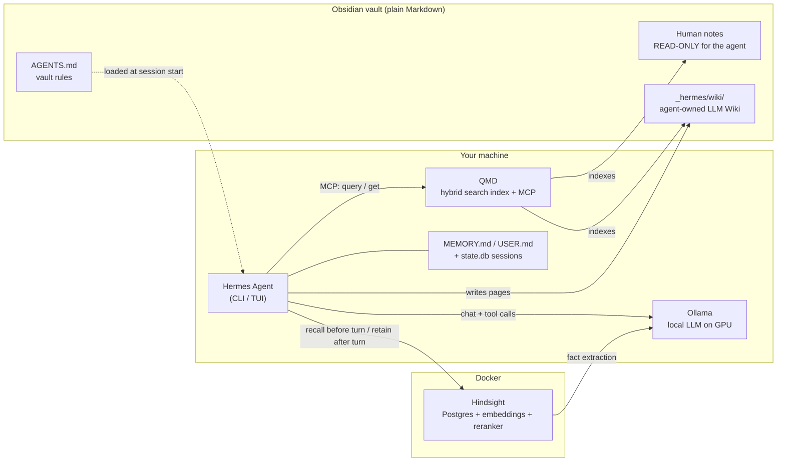

# Hermes Workshop - 01 Architecture and Concepts

Back to [Hermes-Obsidian-Workshop](README.md) · Next: [02 Install Guide](02-install-guide.md)

## The problem
A big vault (thousands of notes: daily notes, work logs, runbooks, reading notes) becomes a **write-only
database**. The knowledge is in there, but finding and connecting it costs more time than re-deriving it.

Goal: an agent that can **search** the vault, **extract** durable knowledge into a curated wiki, and **remember**
you across sessions. It should run fully self-hosted, keep your notes as plain Markdown, and not wreck the vault.

## The stack at a glance

| Layer | Component | Job | Where it runs |
|---|---|---|---|
| Source | Your vault | The truth. Human-written, never modified by the agent | Disk |
| Rules | `AGENTS.md` at vault root | Tells the agent what it may touch, how to search, how to cite | Loaded into the system prompt |
| Retrieval | **QMD** | BM25 + vector + LLM rerank over all notes, exposed as MCP tools | Host (Node, GGUF models ~2 GB) |
| Knowledge | **LLM Wiki** skill (bundled) | Compiles notes into entity/concept pages with citations | Hermes writes to `_hermes/wiki/` |
| Memory (hot) | `MEMORY.md` + `USER.md` | Tiny, always in the prompt: who you are, conventions | `~/.hermes/memories/` |
| Memory (deep) | **Hindsight** | Long-term facts from conversations, entity graph, recall/reflect | Docker |
| Brain | **Ollama** + local model | The LLM for Hermes and for Hindsight's fact extraction | Host GPU |

## Concept 1 — Memory is NOT vault search
The most common setup mistake. They are different systems with different inputs:

| | Memory provider (Hindsight, Mem0, Honcho…) | Vault search (QMD) |
|---|---|---|
| Input | **Your conversations** with the agent | **Your notes** |
| Answers | "What does Seb prefer? What did we decide last week?" | "What do my notes say about X?" |
| Written by | Agent, automatically after each turn | You (the index just mirrors files) |
| Don't | Bulk-load your vault into it | Expect it to remember chats |

Hermes' own memory is layered:
- **Hot**: `MEMORY.md` (~2,200 chars) + `USER.md` (~1,375 chars), a *frozen snapshot* injected at session start.
  Treat `MEMORY.md` as an **index that points into the vault**, not as storage.
- **Deep**: `session_search` over `~/.hermes/state.db` (SQLite FTS5 over all past sessions).
- **External** (optional, one at a time): Hindsight / Mem0 / Honcho / Holographic / ... runs **alongside** built-in memory.
- **Self-learning loop**: every `nudge_interval` user turns (default 10) Hermes reviews the conversation and decides
  whether anything is worth saving to `USER.md`/`MEMORY.md`/skills. If nothing is, it saves nothing.

## Concept 2 — Two authors
> "If the agent writes everything, the wiki drifts toward generic prose. If I maintain everything manually, it decays."
> — Danny Shmueli

- **Human layer** (everything outside `_hermes/`): strategy, taste, decisions, voice. Agent reads it, never edits it.
- **Agent layer** (`_hermes/wiki/`): summaries, entity pages, cross-links, citations. Agent maintains it; you review it.

## Concept 3 — The LLM Wiki pattern (Karpathy)
RAG re-discovers knowledge from scratch on every query. The LLM Wiki **compiles** it once into interlinked Markdown
that improves over time. Hermes ships this as the bundled `llm-wiki` skill with three operations:
- **Ingest**: read sources → create/update entity & concept pages (thresholds: 2+ sources, or central to one source)
  → update `index.md` → append to `log.md`.
- **Query**: read `index.md` → read pages → answer with citations → optionally file the answer under `queries/`.
- **Lint**: orphans, broken links, missing frontmatter, stale pages, contradictions, pages over 200 lines.

**Adaptation for an existing vault:** the skill normally copies sources into `raw/`. With a big existing vault,
*the vault is the raw layer*. Pages cite notes with `sources: ["[[Note Name]]"]` instead of copying them.
Written down in `_hermes/wiki/SCHEMA.md`.

## Concept 4 — Why hybrid search
| Vault size | What's enough |
|---|---|
| < 50 notes | grep |
| 50–500 | BM25 / full-text |
| 500–5,000 | + vectors, fused with Reciprocal Rank Fusion |
| 5,000+ | full pipeline + reranking + credential filtering |
(Scaling guidance from Blake Crosley's Obsidian MCP guide.)

- **BM25** wins on exact identifiers: error codes, ticket IDs, function names.
- **Vectors** win when your note uses different words than your question.
- **Reranker** (small cross-encoder LLM) fixes the ordering. In an independent 2,400-note benchmark, QMD hybrid
  gave a clear score spread (0.93→0.45) where BM25-only tools clustered at 0.88–0.89.
- **Context labels per folder** (`qmd context add`) help as much as the algorithm: the reranker can tell a
  daily note from a runbook.

## Concept 5 — Safety model (be honest about it)
| Control | Strength | How |
|---|---|---|
| `AGENTS.md` rules ("outside `_hermes/` is read-only") | **Soft**: the model can ignore it | Loaded into every session |
| Git history (auto-commit) | Recovery, not prevention | obsidian-git / backup cron |
| Disable `web`/`browser`/`tts`/`image_gen`/`vision` toolsets | **Hard** for exfiltration via those tools | `hermes tools disable …`; they're **on by default** |
| `HERMES_WRITE_SAFE_ROOT=<vault>/_hermes:~/.hermes` | **Hard for `write_file`/`patch`**, not for shell redirects | Verified: write to a human note rejected, file byte-identical |
| Unattended-session guard | Medium | `--oneshot` runs can't `execute_code` (observed) |
| Hermes dangerous-command approvals | Medium | Default on; don't use `--yolo` on your vault |
| Plugin security scan | Medium | Hermes blocks risky community plugins on install |
| Deterministic checks (`wiki_check.py`) | Catches bookkeeping errors the LLM misses or denies | Run after every ingest/fix |
| Run Hermes in Docker, mount vault `:ro` + wiki `:rw` | **Hard** | See the install guide's "hardened" variant |
| Local LLM (Ollama) | Data never leaves the machine | Matters when notes contain work data or secrets |

Secrets: real vaults contain pasted tokens. Local models keep them on-device, but the agent can still echo them
into a wiki page. Hence the hard rule in `AGENTS.md` / `SCHEMA.md`, plus scanning your vault before you start.

## Concept 6 — Local model constraints (the part blogs gloss over)
- Hermes v0.21 **refuses tool use below 64K context** ("Ollama runtime context is too small for Hermes tool use").
- Original Qwen3 models are capped at **40,960** context in Ollama, so they fail this check. Use a model with native
  long context (e.g. `qwen3:30b-a3b-instruct-2507`, 256K).
- Small dense models (8B) *call* tools fine but **hallucinate the answer instead of reading the note**. Verified live;
  see [06 Demo Log](06-demo-log.md).
- MoE models (30B total / 3B active) are the sweet spot on a 10–12 GB GPU: weights spill into system RAM,
  but only 3B parameters are active per token, so it stays usable.
- Hermes and Hindsight must request the **same `num_ctx`**, or Ollama reloads the model every time they alternate.
- **Local models overclaim.** Observed: "I will remember" with 0 tool calls; "All changes verified" with 6 links still
  broken; "the wiki is in optimal condition" with 13 dangling links. Status messages aren't evidence; exit codes are.

## Concept 7 — Memory hygiene
Auto-retain stores **whatever happened**, including hallucinations, false "done" claims, and one-off permissions
("Seb allows writing to X"). All of those were observed in the reference run. Treat long-term memory like a database
you're responsible for:
- review the Hindsight UI (http://localhost:9999) after sessions that went wrong
- delete a bad session's memories: `DELETE /v1/default/banks/<bank>/documents/<session_id>`
- write a `bank_retain_mission` that says what **not** to store (credentials, test instructions)
